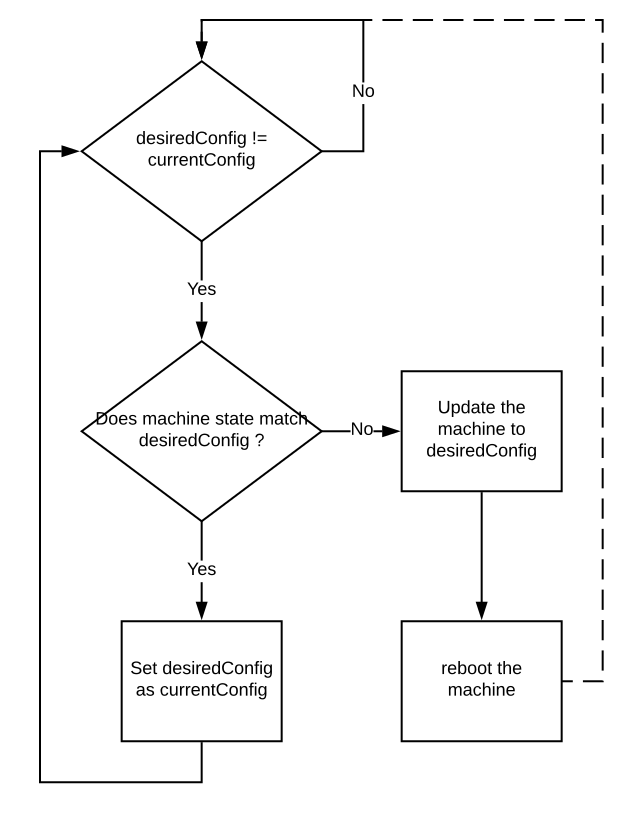

# MachineConfigDaemon

## Goals

1. Apply new machine configuration during update.

2. Validate and verify machine's state to the requested machine configuration.

## Non Goals

1. MachineConfigDaemon does not execute scripts on the machines.

## Overview

MachineConfigDaemon is scheduled on the machines in a cluster as a DaemonSet. This daemon is responsible for performing machine updates for Openshift. The update will include tasks related to the systemd units, files on disk, operating system upgrades etc. The MachineConfigDaemon updates a machine to configuration defined by MachineConfig as instructed by the MachineConfigController.

## Supported vs Unsupported Ignition config changes

The MachineConfigDaemon receives machine configuration for update in the form of an Ignition config. The updated Ignition config will contain changes that the daemon is incapable of applying while others that can be applied and verified.

Ignition sections | Supported
--- | ---
Networkd | NO
Users | NO
Directories | YES
Files | YES
FileSystems | NO
Links | YES
Disks | NO
RAID | NO
systemd Units | YES

MachineConfigDaemon should be able to apply and verify updates to all the supported sections.

For update to unsupported section, MachineConfigDaemon has few options,

1. Exit with errors stopping updates.

2. Ignore and record WARNING.

3. Request decommission of the machine from cluster so that changes are adopted by new machine.

## Coordinating updates

MachineConfigDaemon uses [annotations defined](./MachineConfigController.md#updatecontroller-interface-with-machineconfigdaemon) on the Node object to coordinate updates with MachineConfigController for the machine.

### States

1. `Done` when daemon sets currentConfig <= desiredConfig

2. `Working` when daemon starts updating the machine.

3. `Degraded` when daemon cannot continue to apply the update.

## OS updates

MachineConfigDaemon should be able to update the operating system of the machine.

- Updates will use `rpm-ostree` (which uses the `ostree` library)
- Content will come down via an OCI image (container) which houses the ostree compose
- `rpm-ostree` will point to the content in the container through a decided upon method (this may be provided in cluster via the images http server serving the `ostree` content, or it may be pulled locally, mounted, and referenced)
- `rpm-ostree` will deploy (or upgrade in this sense of the terminology) the latest update along side the running system and create a new grub entry
- When the system reboots the new update will become the running system

### Verfication

**TODO:add how to verify OS version**

## systemd unit updates

MachineConfigDaemon replaces the unit service files on disk. The updated systemd services run after machine reboot.

The daemon should prune all the systemd units that don't exist in the desiredConfig but existed before. Diff the current config and desired config, then remove the units that were removed.

### Verification

1. MachineConfigDaemon verifies that contents and existence of the systemd unit files.

2. MachineConfigDaemon also verifies that the systemd service is enabled when specified in Ignition config.

## Directory / File updates

MachineConfigDaemon replaces the file contents on disk with the contents of the file from the desiredConfig.

The daemon should apply any change in permissions on file / directories.

The daemon should prune all the files and directories that don't exist in the desiredConfig but existed before. Diff the current config and desired config, then remove the nodes that were removed.

### Verification

MachineConfigDaemon verifies that contents and existence of the files and directories. The daemon should also verify the permission on file and directories.

## Machine reboot

MachineConfigDaemon reboots the machine after applying the updated machine configuration.

### Node drain

The daemon performs best-effort node drain before rebooting.

The node drain behavior:

1. Should not try to remove static pods.

2. Should respect pod disruption policy for evictions.

3. Should not evict pods marked with critical annotation.

4. Should not evict itself from the node.

### Node drain on master nodes

The draining on master nodes should not be different from worker node as the control plane is self-hosted.

### Node drain master in single master

The draining of pods on the only master node will not evict the control plane as they have critical pod annotation. After rebooting the only master, the pod-checkpointer brings back the components responsible for restarting the control plane.

### Node drain etcd static pods on masters

Etcd is co-located on master nodes as static pods. The draining behavior defined above prevents draining of static pods to prevent interference to etcd cluster by the daemon.