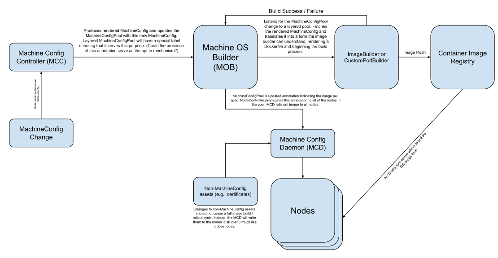

# Machine OS Builder Design

In the context of the Machine Config Operator (MCO) in Red Hat
OpenShift, on-cluster builds refer to the process of building an OS
image directly on the OpenShift cluster, rather than building them
outside the cluster (such as on a local machine or continuous
integration (CI) pipeline) and then making a configuration change so
that the cluster uses them. By doing this, we enable cluster
administrators to have more control over the contents and configuration
of their clusters’ OS image through a familiar interface (MachineConfigs
and in the future, Dockerfiles).

## Sub-components and design

On-cluster builds are achieved with the help of several subcomponents
that work in concert with one another. This is a brief overview of what
they do and how they work:

### Machine OS Builder (MOB)

This is an additional binary which forms a part of the Machine Config
Operator. By implementing as much of the on-cluster build functionality
within the MOB binary, we can ensure that the code paths are only
reached whenever a cluster admin explicitly opts into OS layering. This
top-level component (and its subcomponents described below) is only
started whenever a cluster administrator opts in. If a cluster
administrator opts out, it will gracefully shut down. The below
subcomponents (BuildController, ImageBuildController,
PodBuildController) are part of the MOB binary.

### BuildController

BuildController is the entrypoint for determining whenever an OS build
is required as well as ingesting the user-provided configuration details
(described below). BuildController listens for changes to
MachineConfigPools and determines whether a change requires a new OS
image build. At the time of this writing, only a rendered MachineConfig
change will cause a new build to be performed. Other changes to
MachineConfigPools will be ignored at this time. It is worth noting that
BuildController only determines whether a build is needed, makes the
necessary preparations, starts the build, and updates the
MachineConfigPool with the current build state. Upon completion, it will
retrieve the image pullspec from the build process and update the
MachineConfigPool object with the latest image pullspec.

To actually perform the build, BuildController makes use of either the
ImageBuildController or the PodBuildController as described below. It is
important to understand that ImageBuildController and PodBuildController
are designed to be as interchangeable as possible. Additional image
builders may be produced in the future to support additional use-cases
and to optimize the build process within certain OpenShift contexts
(e.g., single-node). However for now, we have the two described below.

### ImageBuildController

ImageBuildController makes use of the OpenShift Image Builder
functionality which is currently a core feature of OpenShift. When this
feature is present on ones’ OpenShift cluster, BuildController will
start an ImageBuildController which creates an OpenShift Build object to
perform the build. Because OpenShift Image Builder will eventually
become an optional component, it makes sense that we should have a
second mechanism for clusters which do not have the OpenShift Image
Builder capability enabled. Using OpenShift Image Builder allows us to
avoid implementing this specific functionality itself and has the
additional benefit that the OpenShift Image Builder components are
lifecycled and versioned along with the rest of the OpenShift release
process.

### PodBuildController

PodBuildController enables builds by creating a custom build pod, which
uses the officially published Buildah image
(`quay.io/buildah/stable:latest`). Additionally, PodBuildController
attempts to run with the fewest privileges possible. To do so, the
`machine-os-builder` service account (which MOB runs as) sets the `anyuid`
Security Context Constraint. This allows us to map the build UID
contained within the Buildah container to a UID on our cluster,
effectively allowing us to run as an unprivileged pod, without root
permissions. A limitation of using Buildah is that to get the final
image digest after a push operation, we must write a file to the
filesystem (called a `digestfile` in Buildah parlance). To get this value
back to BuildController, we add a second container (called
`wait-for-done`) onto our build pod which waits for the `digestfile` to be
written to the emptyDir volume shared between the wait-for-done
container and the image-build container. Once the `digestfile` exists,
the `wait-for-done` container uses the `oc` binary built into the base OS
image to create a ConfigMap containing the `digestfile`. The
PodBuildController will then read this ConfigMap, get the digestfile
contents, and delete the ConfigMap once the build is successful. It will
then construct a fully-qualified image pullspec based upon the
user-provided final OS image pullspec and the digest retrieved from the
digestfile.

## Detailed flow

Once a cluster administrator opts a MachineConfigPool in to OS layering,
the following describes the typical build process:

1. The MCO will set up all of the service accounts, RBAC rules, etc. to
   allow the MOB to perform its functions. It will then start a
   single replica of the MOB process.

2. For now, the MOB process will start a BuildController which uses the
   ImageBuildController. This will change in the future (see Known
   Limitations for details).

3. BuildController looks for MachineConfigPools that have been opted
   into OS layering, looking for the existence of the
   `machineconfiguration.openshift.io/layering-enabled` label on all
   MachineConfigPools. It will create one build process for each
   MachineConfigPool opted in, using the rendered MachineConfig name
   as a unique identifier for all of the objects it creates. Each
   build process lives in its own build pod with its own unique
   inputs.

4. BuildController will read the `on-cluster-build-config` ConfigMap to
   get the base OS image pull secret, the final OS image push secret,
   and the pullspec for the final OS image. If necessary, the push
   and pull secrets will be converted from `.dockercfg` to
   `.dockerjsoncfg`.

5. BuildController will read the `machine-config-osimageurl` ConfigMap to
   get the base OS image and extensions image pullspecs. These will
   be used to render the Dockerfile. If no extensions image is
   present, the section of the Dockerfile which requires the
   extensions image will not be rendered.

6. The Dockerfile will be rendered and temporarily stored as a
   ConfigMap within the MCO namespace for the lifetime of the OS
   image build process.

7. The rendered MachineConfig will be gzipped and base64-encoded and
   temporarily stored as a ConfigMap within the MCO namespace for the
   lifetime of the OS image build process. Because ConfigMaps can
   only store a maximum of 1 MB, the MachineConfig is gzipped and
   Base64-encoded before storing in a ConfigMap. The Base64-encoding
   is required because ConfigMaps are not intended to store binary
   data, which is what one gets after gzipping. (see: Known Limitations).

8. Either a new OpenShift Image Build or custom build pod will be
   created to consume the Dockerfile and the rendered MachineConfig
   ConfigMaps to perform the build. The rendered Dockerfile will be
   exactly the same regardless of which builder is used (although in
   the future, we could add a label indicating which image builder
   was used). The Dockerfile essentially copies the rendered
   MachineConfig from the ConfigMap into the base image,
   Base64-decodes and gunzips it, then calls ignition live-apply to
   write the MachineConfig contents to the OS image. Although there
   is a section to perform operations on the extensions image, it
   does not currently do anything other than pull the extensions
   image (see: Known Limitations).

9. Upon successful completion of the build, the image is pushed to the
   configured image registry, using the rendered MachineConfig name
   as a tag. For example:
   `quay.io/myorg/myrepo:rendered-worker-dd37180cefa6a1e88834966330c0c028`).
   However, the SHA256 digest which points to this tag is obtained
   and used to create a fully-qualified pullspec. Any user-supplied
   tags will be ignored. Obtaining the final image pullspec is done
   in one of two ways:

   - For `ImageBuildController` builds, this value is retrieved from
     the OpenShift Image Build object and returned.

   - For `PodBuildController` builds, a second container process waits
     for the Buildah digestfile to be written to an emptyDir
     volume. Once written, the second container process will write
     the digestfile contents to an ephemeral ConfigMap in the MCO
     namespace which is later retrieved and deleted by the
     PodBuildController.

10. Once the final image pullspec is obtained, an annotation
    (`machineconfiguration.openshift.io/newestImageEquivalentConfig`) on
    the MachineConfigPool object is updated with the fully-qualified
    pullspec (e.g.,
    `quay.io/myorg/myrepo@sha256:324f17d18b197a951e7e11ea0b101836312191f92aefa0fc2ee240354cfbf7fc`).
    Additionally, the `BuildSuccess` status condition is set on the
    MachineConfigPool.

11. The BuildController then deletes all of the ephemeral objects it
    created to perform the build. This includes the build pod object
    or OpenShift Image Build object, the rendered Dockerfile
    ConfigMap, the rendered MachineConfig ConfigMap, as well as the
    `digestfile` ConfigMap (if created). In cases where a build was
    unsuccessful, these objects will not be deleted to allow a cluster
    administrator the opportunity to review / gather the logs as well
    as the inputs into the process.

12. The MachineConfigPool annotation will be rolled out
    to all of the target nodes by the Node Controller using a similar
    process to how MachineConfigs are currently rolled out.

# Frequently Asked Questions

## What labels are added onto the final OS image?

Image labels indicating what MachineConfigPool this targets, the rendered
MachineConfig used to produce the configs, the base OS image pullspec, and
extensions OS image pullspec (when available) are added onto the final OS image.
This will enable future optimizations and enhancements by enabling a build to be
skipped whenever we already have an appropriate image built for that
MachineConfig.